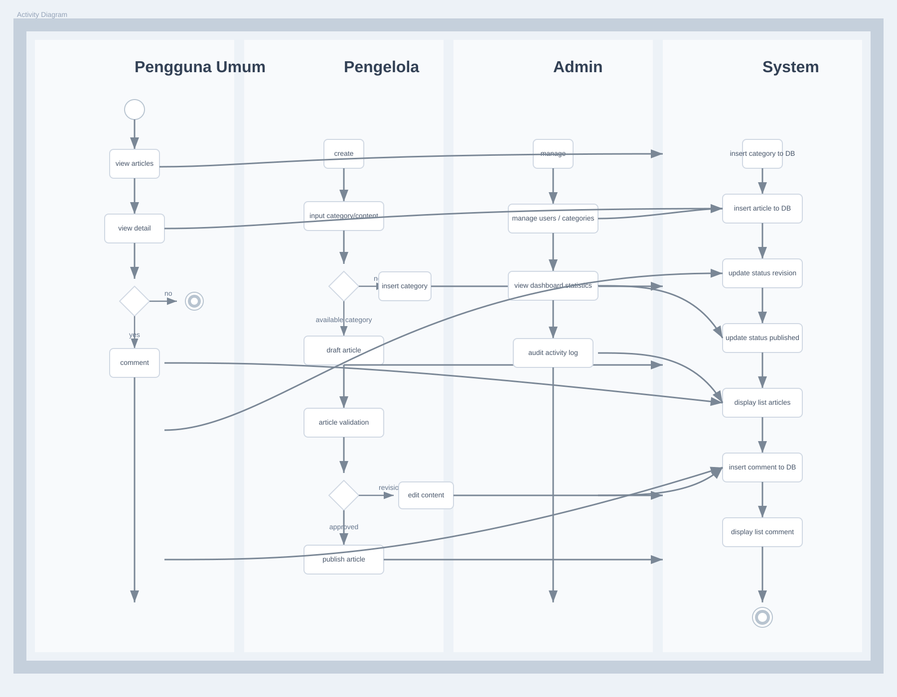

# BAB IV ANALISIS DAN PENGUJIAN

## IV.5 PENGUJIAN SISTEM

### IV.5.1 Pengujian Black Box

Pengujian black box dilakukan untuk memastikan seluruh fungsi sistem berjalan sesuai kebutuhan tanpa melihat implementasi kode secara langsung. Pada tahap ini, pengujian dilakukan melalui dua sumber validasi, yaitu:

1. Skenario pengujian backend otomatis pada file `backend/tests/auth-article.test.js`.
2. Skenario pengujian API menggunakan Newman pada koleksi Postman yang tersimpan di `docs/postman/`.

Berdasarkan pengujian terbaru, backend otomatis memiliki **39 skenario** dan seluruhnya berhasil. Pengujian Newman melibatkan **23 request** dengan **36 assertion** dan seluruhnya juga berhasil.

Tabel-tabel pada bagian ini disusun untuk memudahkan identifikasi hasil pengujian berdasarkan kelompok fungsi. Penyajian dilakukan mulai dari autentikasi dan hak akses, validasi data, pengelolaan kategori dan user, pengelolaan artikel dan media, hingga fitur product card dan relasi artikel.

#### Ringkasan Hasil Pengujian Backend Otomatis

| Komponen | Hasil |
|---|---:|
| Jumlah skenario | 39 |
| Skenario berhasil | 39 |
| Skenario gagal | 0 |
| Persentase keberhasilan | 100% |

#### Ringkasan Hasil Pengujian Newman

| Komponen | Hasil |
|---|---:|
| Jumlah iterasi | 1 |
| Jumlah request | 23 |
| Request gagal | 0 |
| Jumlah assertion | 36 |
| Assertion gagal | 0 |
| Total durasi pengujian | 3,5 detik |
| Rata-rata response time | 68 ms |
| Data diterima | 11,4 kB |

**Perintah pengujian Newman:**

```bash
npx newman run docs/postman/coconexus-api-newman.collection.json \
  -e docs/postman/coconexus-api-newman.environment.json \
  --reporters "cli,json" \
  --reporter-json-export docs/newman-results/coconexus-api-newman-result.json
```

#### Tabel IV.5.1.1 Pengujian Autentikasi, Akses, dan Hak Role

| No | Skenario Pengujian | Endpoint/Alur | Data Uji | Hasil yang Diharapkan | Hasil Aktual | Status |
|---:|---|---|---|---|---|---|
| 1 | Registrasi publik mengabaikan role admin | `/api/auth/register` | `role: admin` dalam request | Akun tetap dibuat sebagai `user` | Status 201, role tetap `user` | Berhasil |
| 2 | User biasa mengakses dashboard admin | `/api/admin/stats` | Token user biasa | Akses ditolak | Status 403 | Berhasil |
| 3 | User biasa membuat artikel di route pengelola | `/api/articles` | Token user biasa | Akses ditolak | Status 403, `success: false` | Berhasil |
| 4 | Pengelola membuat dan mengambil artikel | `/api/articles` dan `/api/articles/:id` | Token pengelola valid | Artikel dapat dibuat dan dibaca | Status 201 dan 200 | Berhasil |
| 5 | Publisher mempublikasikan draft artikel | `/api/articles/:id/status` | Status `published` | Draft berubah menjadi published | Status 200, status `published` | Berhasil |
| 6 | Writer tidak boleh mempublikasikan artikel | `/api/articles/:id/status` | Token writer | Akses ditolak | Status 403 | Berhasil |
| 7 | Publisher mempublikasikan draft milik pengelola lain | `/api/articles/:id/status` | Token publisher | Artikel berhasil dipublikasikan | Status 200, status `published` | Berhasil |
| 8 | Tag manager mengelola kategori, writer tidak | `/api/categories` | Token tag manager dan writer | Tag manager berhasil, writer ditolak | Status 201 dan 403 | Berhasil |
| 9 | Comment moderator mengakses modul komentar, writer tidak | `/api/comments?status=pending` | Token moderator dan writer | Moderator berhasil, writer ditolak | Status 200 dan 403 | Berhasil |
| 10 | Pengelola tidak boleh mempublikasikan artikel milik penulis lain | `/api/articles/:id/status` | Token pengelola bukan pemilik | Akses ditolak | Status 403 | Berhasil |
| 11 | Login dengan password salah | `/api/auth/login` | Password tidak valid | Login ditolak | Status 401 | Berhasil |
| 12 | Registrasi dengan password lemah | `/api/auth/register` | Password pendek | Registrasi ditolak | Status 400 | Berhasil |
| 13 | Registrasi email duplikat aktif | `/api/auth/register` | Email yang sudah terdaftar | Registrasi ditolak | Status 409 | Berhasil |
| 14 | Daftar artikel admin tanpa token | `/api/articles/admin` | Tidak ada token | Akses ditolak | Status 401 | Berhasil |
| 15 | Daftar artikel admin dengan token invalid | `/api/articles/admin` | Token salah | Akses ditolak | Status 401 | Berhasil |

#### Tabel IV.5.1.2 Pengujian Validasi Data dan Interaksi Publik

| No | Skenario Pengujian | Endpoint/Alur | Data Uji | Hasil yang Diharapkan | Hasil Aktual | Status |
|---:|---|---|---|---|---|---|
| 16 | Admin membuat artikel tanpa body content | `/api/articles/admin` | Judul tanpa konten | Data ditolak | Status 400 | Berhasil |
| 17 | Admin mengunggah media dengan tipe tidak didukung | `/api/uploads/articles` | File `.exe` | Upload ditolak | Status 400, `success: false` | Berhasil |
| 18 | User berkomentar pada artikel draft | `/api/articles/:id/comments` | Token user dan artikel draft | Komentar ditolak | Status 404 | Berhasil |
| 19 | User mengirim komentar kosong pada artikel published | `/api/articles/:id/comments` | Isi komentar spasi | Komentar ditolak | Status 400 | Berhasil |
| 20 | Komentar pending disembunyikan sampai disetujui | `/api/comments/:id/status` | Status `pending` lalu `approved` | Komentar tidak tampil sebelum disetujui | Status sesuai alur | Berhasil |
| 21 | Moderator menolak komentar dan komentar tetap tersembunyi | `/api/comments/:id/status` | Status `rejected` | Komentar tidak tampil di publik | Status 200, komentar tetap tersembunyi | Berhasil |
| 22 | Daftar artikel publik menyembunyikan draft | `/api/articles/published` | Artikel draft dan published | Hanya published yang tampil | Status 200, draft tidak muncul | Berhasil |
| 23 | Detail artikel published mencatat article view | `/api/articles/published/:id` | `x-coconexus-session-id` | View tercatat | Status 200, view bertambah | Berhasil |

#### Tabel IV.5.1.3 Pengujian Manajemen Kategori dan User

| No | Skenario Pengujian | Endpoint/Alur | Data Uji | Hasil yang Diharapkan | Hasil Aktual | Status |
|---:|---|---|---|---|---|---|
| 24 | Admin membuat kategori dan menolak kategori duplikat | `/api/categories/admin` | Nama kategori sama | Kategori pertama tersimpan, duplikat ditolak | Status 201 dan 409 | Berhasil |
| 25 | Admin tidak dapat menghapus kategori yang masih dipakai artikel | `/api/categories/admin/:id` | Kategori masih berelasi | Penghapusan ditolak | Status 409 | Berhasil |
| 26 | Admin memperbarui role dan profil user | `/api/users/admin/:id` | `role`, `full_name`, `bio` | Data user berubah | Status 200, data terupdate | Berhasil |
| 27 | Daftar user admin menampilkan field job, department, dan division | `/api/users/admin` | Token admin valid | Field profil tampil lengkap | Status 200, field tersedia | Berhasil |
| 28 | Admin tidak dapat soft delete akun sendiri | `/api/users/admin/:id` | ID akun admin sendiri | Penghapusan ditolak | Status 403 | Berhasil |
| 29 | User memperbarui profil sendiri | `/api/users/me/profile` | `full_name` dan `bio` baru | Profil berubah | Status 200, profil terupdate | Berhasil |

#### Tabel IV.5.1.4 Pengujian Manajemen Artikel dan Media

| No | Skenario Pengujian | Endpoint/Alur | Data Uji | Hasil yang Diharapkan | Hasil Aktual | Status |
|---:|---|---|---|---|---|---|
| 30 | Admin login lalu membuat draft artikel dengan kategori otomatis | `/api/articles/admin` | Judul, konten, kategori baru | Artikel draft tersimpan dan kategori dibuat otomatis | Status 201, status `draft` | Berhasil |
| 31 | Admin membuat artikel dengan dynamic product cards | `/api/articles/admin` | `product_cards` berisi beberapa item | Product card tersimpan dan terhubung ke artikel | Status 201, card tersimpan | Berhasil |
| 32 | Endpoint validasi artikel dapat mempublikasikan draft | `/api/articles/admin/:id/status` | Status `published` | Status artikel berubah menjadi published | Status 200, status `published` | Berhasil |
| 33 | Admin mengunggah file media artikel | `/api/uploads/articles` | File gambar valid | Media tersimpan dan path dibentuk otomatis | Status 201, `media_type: image` | Berhasil |
| 34 | Dashboard stats menampilkan dataset chart kategori dan komentar | `/api/admin/stats` | Token admin valid | Dataset statistik tersedia | Status 200, chart tersedia | Berhasil |

#### Tabel IV.5.1.5 Pengujian Product Card dan Linking Artikel

| No | Skenario Pengujian | Endpoint/Alur | Data Uji | Hasil yang Diharapkan | Hasil Aktual | Status |
|---:|---|---|---|---|---|---|
| 35 | Endpoint available product cards hanya menampilkan card yang belum terhubung | `/api/articles/admin/product-cards/available?article_id=...` | Article ID utama | Hanya card yang belum linked yang tampil | Status 200, card unlinked tampil | Berhasil |
| 36 | Endpoint main articles menampilkan artikel induk untuk dropdown | `/api/articles/admin/main-articles` | Token admin valid | Hanya artikel induk yang muncul | Status 200, daftar sesuai | Berhasil |
| 37 | Admin membuat artikel detail yang terhubung ke product card terpilih | `/api/articles/admin` | `parent_article_id` dan `linked_product_card_id` | Artikel detail tersimpan dan card terhubung | Status 201, relasi tersimpan | Berhasil |
| 38 | Detail artikel publik menampilkan product cards untuk eksplorasi | `/api/articles/published/:id` | Artikel induk published | Product card dan artikel detail tampil | Status 200, card tampil | Berhasil |
| 39 | Admin memperbarui unlinked product cards dari editor artikel | `/api/articles/admin/:id` | `product_cards` baru | Product card lama terganti | Status 200, card terupdate | Berhasil |

Hasil pengujian black box menunjukkan bahwa seluruh skenario pada setiap kelompok fungsi memberikan keluaran yang sesuai dengan ekspektasi. Pada pengujian autentikasi dan otorisasi, sistem berhasil membedakan akses berdasarkan role sehingga user biasa tidak dapat mengakses fitur administratif. Pada pengujian validasi data, sistem menolak input yang tidak sesuai, seperti artikel tanpa konten, komentar kosong, atau file media dengan tipe yang tidak didukung.

Selain itu, pengujian pengelolaan kategori dan user menunjukkan bahwa data relasional dapat dikelola dengan benar tanpa melanggar aturan integritas data. Pengujian artikel dan media juga memperlihatkan bahwa sistem mampu menangani alur draft, publikasi, penyimpanan media, dan pembentukan data statistik. Pada pengujian product card, sistem berhasil mempertahankan hubungan antara artikel utama, artikel detail, dan kartu produk yang digunakan untuk navigasi konten.

#### Kesimpulan Pengujian Black Box

Berdasarkan pengujian backend otomatis dan validasi API menggunakan Newman, seluruh skenario yang diuji memberikan respons sesuai dengan hasil yang diharapkan. Pengujian mencakup:

1. Autentikasi dan otorisasi berbasis role.
2. Validasi data pada artikel, komentar, dan media.
3. Pengelolaan kategori serta data user.
4. Workflow artikel, termasuk draft, publish, dan product card.
5. Statistik dashboard dan pencatatan view artikel.

Secara keseluruhan, **39 skenario backend otomatis berhasil** dan **23 request Newman berhasil** dengan **0 kegagalan**.

### IV.5.2 Pengujian User Acceptance Test (UAT)

User Acceptance Test (UAT) dilakukan untuk menilai kesesuaian sistem dengan kebutuhan pengguna dari sisi alur penggunaan dan ketersediaan fitur. UAT pada sistem COCONEXUS disusun berdasarkan tiga aktor utama, yaitu pengguna umum, pengelola, dan admin.

Pada tahap ini, skenario UAT disusun berdasarkan fitur yang benar-benar tersedia pada sistem, seperti membaca artikel publik, registrasi, login, komentar, pembuatan artikel, publikasi artikel, manajemen kategori, manajemen pengguna, media artikel, product card, dan statistik dashboard.

Penyusunan skenario UAT dibagi berdasarkan role agar alur pengujian lebih mudah dipahami. Pengguna umum difokuskan pada akses konten publik dan interaksi dasar, pengelola difokuskan pada workflow konten dan moderasi, sedangkan admin difokuskan pada pengelolaan data dan statistik sistem.

#### Tabel IV.5.2.1 UAT - Pengguna Umum

| No | Aktor | Skenario UAT | Kriteria Penerimaan | Verifikasi | Status |
|---:|---|---|---|---|---|
| 1 | Pengguna Umum | Mengakses halaman publik tanpa login | Daftar artikel dan navigasi publik tampil | Halaman publik dapat diakses dengan baik | [ ] Diterima |
| 2 | Pengguna Umum | Melihat daftar artikel published | Artikel published tampil dan draft tidak ikut muncul | Hanya artikel published yang tampil | [ ] Diterima |
| 3 | Pengguna Umum | Membuka detail artikel published | Konten artikel, media, dan product card tampil | Detail artikel dapat dibaca lengkap | [ ] Diterima |
| 4 | Pengguna Umum | Melakukan registrasi akun baru | Akun berhasil dibuat sebagai user biasa | Registrasi berhasil dan dapat login | [ ] Diterima |
| 5 | Pengguna Umum | Login dengan akun yang sudah terdaftar | Token atau session login aktif | User dapat masuk ke sistem | [ ] Diterima |
| 6 | Pengguna Umum | Mengirim komentar pada artikel published | Komentar tersimpan dengan status pending | Komentar berhasil dikirim | [ ] Diterima |
| 7 | Pengguna Umum | Mengirim komentar kosong | Sistem menolak input kosong | Validasi komentar berjalan | [ ] Diterima |
| 8 | Pengguna Umum | Memperbarui profil sendiri | Nama dan bio user berubah | Profil berhasil disimpan | [ ] Diterima |
| 9 | Pengguna Umum | Melihat artikel berdasarkan kategori | Artikel dapat difilter sesuai kategori | Filter kategori berjalan | [ ] Diterima |
| 10 | Pengguna Umum | Mencari artikel melalui search | Artikel yang relevan muncul di hasil pencarian | Search menampilkan hasil yang sesuai | [ ] Diterima |

Berdasarkan tabel UAT untuk pengguna umum, sistem telah menyediakan pengalaman akses publik yang lengkap. Pengguna dapat membaca artikel, melihat detail konten, berinteraksi melalui komentar, serta memperbarui profilnya. Ini menunjukkan bahwa fitur publik telah mendukung kebutuhan utama pengguna tanpa harus masuk ke area administratif.

#### Tabel IV.5.2.2 UAT - Pengelola

| No | Aktor | Skenario UAT | Kriteria Penerimaan | Verifikasi | Status |
|---:|---|---|---|---|---|
| 1 | Pengelola | Login dengan akun pengelola | Dashboard pengelola tampil sesuai role | Login berhasil | [ ] Diterima |
| 2 | Pengelola | Membuat artikel draft | Artikel tersimpan dengan status draft | Draft berhasil dibuat | [ ] Diterima |
| 3 | Pengelola | Melihat detail artikel yang dibuat | Detail artikel tampil lengkap | Artikel dapat dibuka dan diperiksa | [ ] Diterima |
| 4 | Pengelola | Mempublikasikan draft artikel sebagai publisher | Status artikel berubah menjadi published | Publish berhasil | [ ] Diterima |
| 5 | Pengelola | Gagal mempublikasikan artikel jika role tidak berwenang | Sistem menolak aksi publish | Akses dibatasi sesuai role | [ ] Diterima |
| 6 | Pengelola | Mengelola kategori sebagai tag manager | Kategori dapat dibuat melalui modul pengelola | CRUD kategori berjalan | [ ] Diterima |
| 7 | Pengelola | Gagal mengelola kategori jika role writer | Sistem menolak aksi kategori | Hak akses terjaga | [ ] Diterima |
| 8 | Pengelola | Mengakses daftar komentar sebagai moderator | Daftar komentar pending tampil | Modul moderasi komentar aktif | [ ] Diterima |
| 9 | Pengelola | Gagal mengakses komentar jika role writer | Sistem menolak akses komentar | Validasi otorisasi berjalan | [ ] Diterima |
| 10 | Pengelola | Menangani artikel milik pengelola lain sesuai hak publish | Publish hanya berhasil jika role berwenang | Aturan kepemilikan diterapkan | [ ] Diterima |

Berdasarkan tabel UAT untuk pengelola, sistem memperlihatkan pemisahan hak akses yang jelas antara writer, moderator, tag manager, dan publisher. Setiap role hanya dapat menjalankan fungsi yang sesuai dengan kewenangannya. Hal ini penting karena proses pengelolaan artikel pada COCONEXUS memang dirancang berbasis workflow, bukan hanya sekadar CRUD biasa.

#### Tabel IV.5.2.3 UAT - Admin

| No | Aktor | Skenario UAT | Kriteria Penerimaan | Verifikasi | Status |
|---:|---|---|---|---|---|
| 1 | Admin | Login dengan akun admin | Dashboard admin tampil | Login berhasil | [ ] Diterima |
| 2 | Admin | Membuat artikel draft dengan kategori otomatis | Artikel dan kategori tersimpan | Proses pembuatan artikel berhasil | [ ] Diterima |
| 3 | Admin | Menambahkan dynamic product cards pada artikel | Product card tersimpan dan terhubung | Card artikel berhasil dibuat | [ ] Diterima |
| 4 | Admin | Memperbarui product cards dari editor artikel | Product card lama terganti dengan data baru | Update card berhasil | [ ] Diterima |
| 5 | Admin | Mengubah status draft menjadi published | Artikel berubah menjadi published | Publish artikel berhasil | [ ] Diterima |
| 6 | Admin | Membuat kategori baru | Kategori tersimpan | Manajemen kategori berhasil | [ ] Diterima |
| 7 | Admin | Menangani kategori duplikat | Sistem menolak kategori yang sama | Validasi duplikasi berjalan | [ ] Diterima |
| 8 | Admin | Menghapus kategori yang masih dipakai artikel | Sistem menolak penghapusan | Relasi data terlindungi | [ ] Diterima |
| 9 | Admin | Mengubah role dan profil pengguna | Role, nama, dan bio user berubah | Manajemen user berhasil | [ ] Diterima |
| 10 | Admin | Melihat daftar user lengkap dengan job field | Field job, department, dan division tampil | Data user tampil lengkap | [ ] Diterima |
| 11 | Admin | Mengunggah media artikel | File media tersimpan dengan benar | Upload berjalan baik | [ ] Diterima |
| 12 | Admin | Melihat statistik dashboard | Dataset chart tampil lengkap | Statistik dapat dibaca dengan baik | [ ] Diterima |

Hasil UAT untuk admin menunjukkan bahwa fungsi administratif utama telah mencakup pengelolaan user, kategori, artikel, media, dan statistik. Dengan demikian, admin memiliki kendali menyeluruh terhadap data sistem, sementara batasan akses tetap menjaga agar perubahan hanya dilakukan oleh role yang berwenang.

#### Catatan UAT

- Kolom status dapat diisi saat pelaksanaan UAT berlangsung.
- Skenario dapat disesuaikan dengan data real yang tersedia pada sistem produksi atau staging.
- Pengujian sebaiknya melibatkan perwakilan dari setiap role agar hasil evaluasi lebih representatif.
- Jika ada skenario yang gagal, catat kendala, penyebab, dan rencana perbaikannya.

### IV.5.3 Activity Diagram

Activity diagram berikut menggambarkan alur utama penggunaan sistem COCONEXUS berdasarkan role pengguna. Diagram ini menampilkan jalur akses publik oleh pengguna umum, pengelolaan konten oleh pengelola, pengelolaan data oleh admin, serta proses penyimpanan dan tampilan pada sistem.



Diagram tersebut memperjelas bahwa alur sistem tidak hanya melibatkan pengguna umum dan admin, tetapi juga pengelola sebagai aktor inti dalam proses produksi konten. Pengelola berperan dalam pembuatan draft, validasi, revisi, dan publikasi artikel, sedangkan sistem mengeksekusi penyimpanan data dan menampilkan konten sesuai statusnya. Visualisasi ini membantu menjelaskan hubungan kerja antar role dan alur data yang terjadi di belakang layar.

## IV.6 HASIL PENGUJIAN

### IV.6.1 Hasil Pengujian Black Box

Hasil pengujian black box menunjukkan bahwa sistem COCONEXUS berjalan stabil pada seluruh skenario yang diuji. Semua skenario backend otomatis berhasil, dan seluruh request Newman juga berhasil dijalankan tanpa kegagalan.

Secara teknis, hasil tersebut memperlihatkan bahwa validasi input, mekanisme otorisasi, dan relasi data pada backend bekerja sesuai rancangan. Tidak ditemukan kegagalan pada skenario pengujian yang disiapkan, sehingga tingkat kesiapan fungsional sistem dapat dinilai baik.

| Metrik | Nilai |
|---|---:|
| Total skenario backend | 39 |
| Skenario backend berhasil | 39 |
| Skenario backend gagal | 0 |
| Total request Newman | 23 |
| Request Newman gagal | 0 |
| Total assertion Newman | 36 |
| Assertion Newman gagal | 0 |
| Persentase keberhasilan | 100% |
| Total waktu Newman | 3,5 detik |

### IV.6.2 Hasil Persiapan UAT

Persiapan UAT telah disusun untuk tiga aktor utama sistem. Total skenario UAT yang disiapkan adalah 32 skenario.

Distribusi skenario UAT sudah proporsional dengan peran masing-masing aktor. Pengguna umum mendapat fokus pada akses dan interaksi publik, pengelola pada workflow konten, dan admin pada pengelolaan data sistem.

| Aktor | Jumlah Skenario | Fokus Pengujian |
|---|---:|---|
| Pengguna Umum | 10 | Akses publik, registrasi, login, komentar, profil |
| Pengelola | 10 | Draft artikel, publish, kategori, komentar |
| Admin | 12 | User management, kategori, media, statistik |

### IV.6.3 Metrik Performa

| Metrik | Nilai |
|---|---:|
| Rata-rata response time | 68 ms |
| Data diterima | 11,4 kB |
| Waktu eksekusi keseluruhan | 3,5 detik |
| Throughput | 6,57 request/detik |

## IV.7 PEMBAHASAN

Bagian ini membahas hasil pengujian yang telah dilakukan, interpretasi temuan, serta implikasi terhadap kualitas sistem.

Secara umum, hasil pengujian memperlihatkan bahwa sistem COCONEXUS tidak hanya berfungsi pada level teknis, tetapi juga memiliki alur penggunaan yang sesuai dengan kebutuhan masing-masing role. Dengan kata lain, sistem sudah layak dinilai dari sisi fungsionalitas dasar dan kesiapan penerimaan pengguna.

### IV.7.1 Analisis Hasil Pengujian Black Box

Hasil pengujian menunjukkan bahwa sistem COCONEXUS telah memenuhi kebutuhan fungsional utama. Beberapa poin penting yang dapat disimpulkan adalah:

1. Autentikasi dan otorisasi berbasis role berjalan baik.
2. Validasi input mencegah data tidak valid masuk ke sistem.
3. Workflow artikel, termasuk draft, publish, dan detail artikel, berjalan konsisten.
4. Moderasi komentar dan pencatatan view artikel berjalan sesuai rancangan.
5. Pengelolaan kategori, user, media, dan product card berhasil diintegrasikan dengan baik.

### IV.7.2 Kesiapan UAT

Skenario UAT yang disusun sudah mencakup alur utama penggunaan sistem oleh pengguna umum, pengelola, dan admin. Dengan cakupan tersebut, UAT dapat digunakan untuk memvalidasi kesesuaian sistem dengan kebutuhan pengguna akhir secara lebih menyeluruh.

### IV.7.3 Temuan Penting

- Sistem stabil dan tidak mengalami kegagalan pada skenario pengujian yang dijalankan.
- Error handling sudah baik karena sistem memberikan respons yang sesuai saat input tidak valid.
- Pembatasan akses berdasarkan role berjalan konsisten.
- Data relasional seperti kategori, artikel, komentar, dan product card terhubung dengan benar.

### IV.7.4 Limitasi

Beberapa keterbatasan yang masih perlu diperhatikan adalah:

1. UAT masih berupa skenario terstruktur dan belum seluruhnya dijalankan oleh responden.
2. Pengujian load dan stress belum dilakukan.
3. Pengujian lintas browser dan lintas perangkat belum dicantumkan pada tahap ini.

### IV.7.5 Rekomendasi

Rekomendasi untuk pengembangan lebih lanjut adalah:

- Menjalankan load testing untuk mengukur kemampuan sistem saat trafik tinggi.
- Menambah end-to-end testing agar integrasi frontend dan backend tervalidasi penuh.
- Menyusun UAT bersama responden agar hasil penerimaan pengguna terdokumentasi secara formal.
- Menambahkan pengujian kompatibilitas browser dan perangkat.

### IV.7.6 Kesimpulan Pembahasan

Berdasarkan pengujian black box, persiapan UAT, dan activity diagram yang disusun, sistem COCONEXUS telah menunjukkan kualitas teknis yang baik. Seluruh skenario backend otomatis berhasil, pengujian Newman juga berhasil tanpa kegagalan, dan skenario UAT telah mencakup alur utama pengguna sistem.
