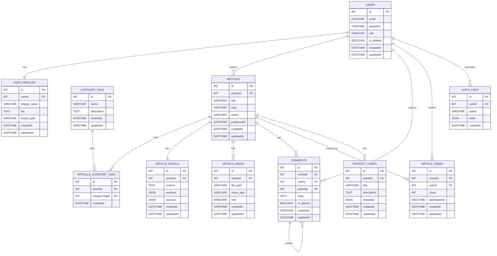

# ERD — COCONEXUS

Berikut ERD dalam format Mermaid dan ringkasan entitas/relasi. Simpan file ini jika ingin mengekspor ke PNG/SVG menggunakan tool eksternal.

**Catatan desain penting**

- Kategori/tags dibuat sebagai entitas `CATEGORY_TAGS` dan dihubungkan ke `ARTICLES` melalui tabel junction `ARTICLES_CATEGORY_TAGS` (many-to-many). Jika sistem hanya butuh satu kategori per artikel, junction dapat dihapus dan gunakan `categoryTagId` di `ARTICLES`.
- `ARTICLE_DETAILS` menyimpan isi lengkap, `ARTICLE_MEDIA` menyimpan file pendukung.
- `COMMENTS` mendukung nested comments melalui `parentId` (FK ke `COMMENTS.id`).
- `ARTICLE_VIEWS` dapat dipakai sebagai per-user view log atau diubah menjadi agregat (hanya `articleId` + `count`).
- `AUDIT_LOGS` menyimpan aktivitas penting; `meta` dapat berisi objek JSON (ip, endpoint, perubahan).

Jika mau, saya bisa:
- Ekspor diagram ke PNG/SVG (butuh tool eksternal);
- Tambahkan DDL SQL migration (Sequelize) untuk tabel-tabel di atas;
- Sesuaikan ERD menjadi versi simplified (no junction) atau versioned (history).
